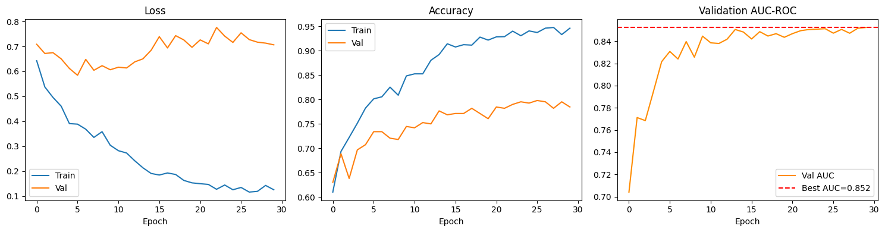
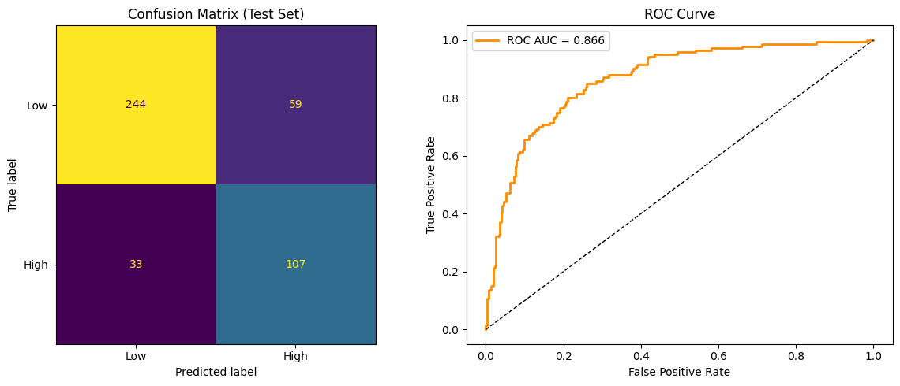
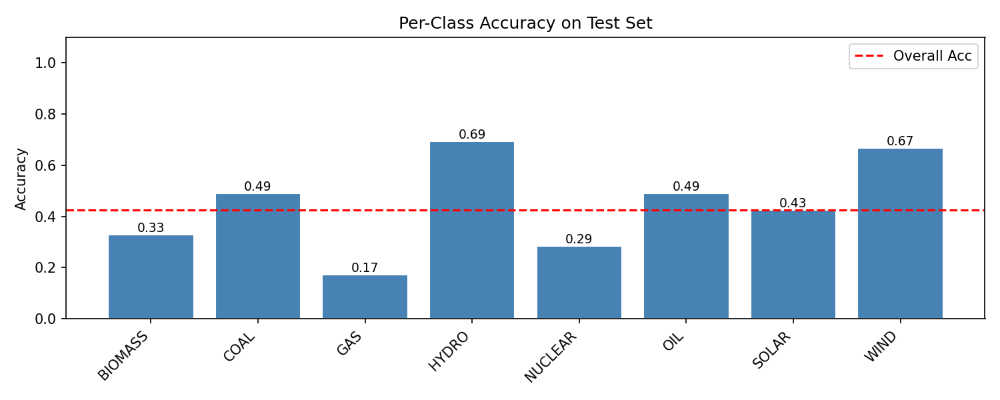
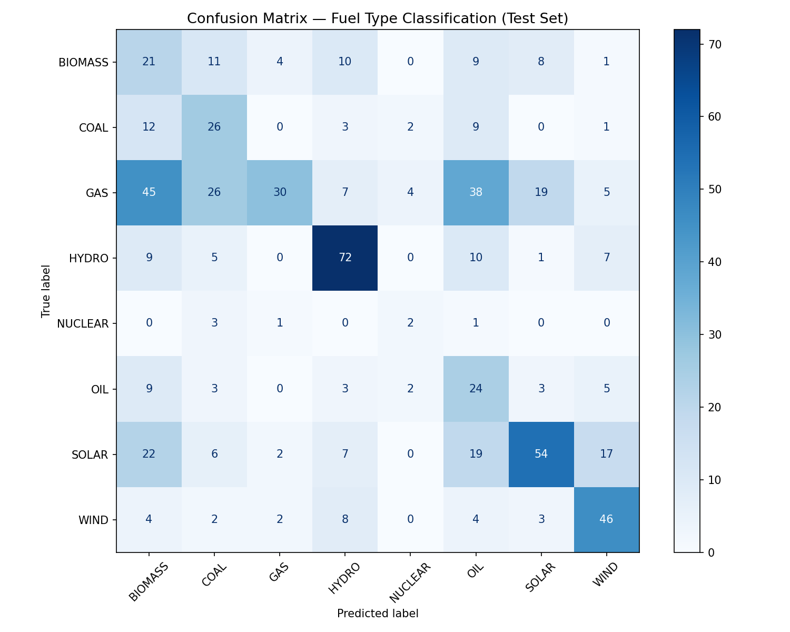
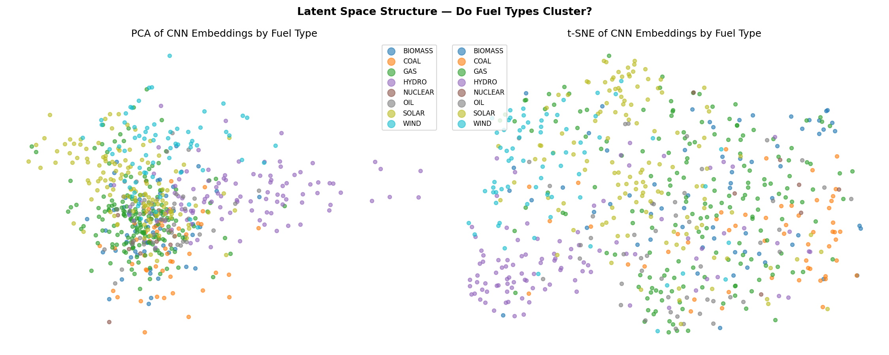
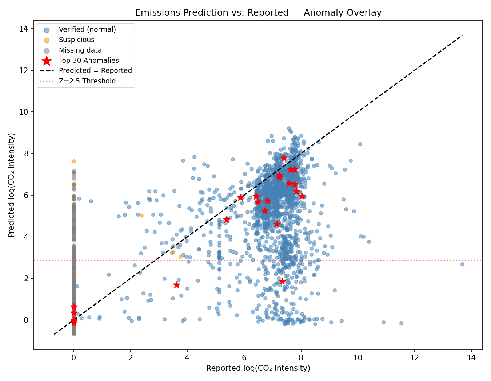
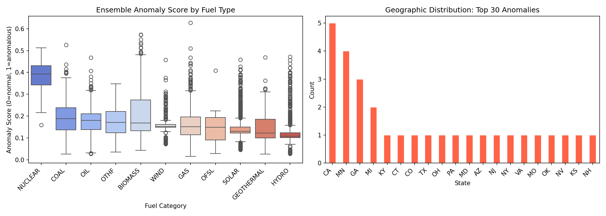
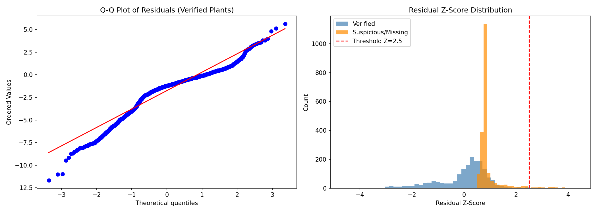
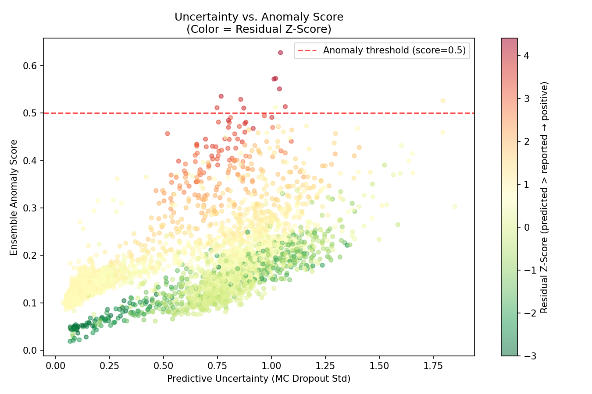

# Emissions from Above
**Classifying Power Plant Pollution Levels via Satellite Imagery and Emissions Data**

Rob Scott · Ananya Sen · Mateo Ronquillo · Efrain Rodriguez

---

## 1. Problem Statement

Power plants are among the largest point-source emitters globally, yet monitoring relies on self-reported data that may be delayed or inaccurate. This project builds a four-task ML pipeline fusing Landsat 8 satellite imagery with EPA eGRID emissions records ultimately building to identify anomalies:

- **Task 1:** Binary classification — high vs. low pollution
- **Task 2:** Multi-class fuel type detection from satellite appearance
- **Task 3:** Continuous CO₂ intensity regression (image + tabular fusion)
- **Task 4:** Anomaly detection — flag underreporting candidates

**Target applications:** regulatory oversight, ESG screening, climate compliance auditing

---

## 2. Dataset Description

**USPPDS imagery** — 4,454 US plants at two resolutions: NAIP 1 m/px (~1,115×1,115 px, annotation ground truth) and Landsat 8 15 m/px (~75×75 px, primary ML input).

**EPA eGRID 2014** — Annual CO₂ emissions, intensity (lbs/MWh), nameplate capacity, capacity factor, net generation, heat rate, coordinates, and primary fuel category per plant.

**Class imbalance** — GAS (1,160) outnumbers NUCLEAR (46) by 25:1, addressed via `WeightedRandomSampler` and class-weighted loss.

---

## 3. Data Preprocessing

| Labels & Targets | Image & Tabular |
|---|---|
| **Binary:** CO₂ intensity quartile thresholds; middle 50% excluded for cleaner signal. | **Bands:** Per-channel min-max normalization to [0,1] per scene. |
| **Multi-class:** PLFUELCT fuel category; classes <20 samples dropped. | **Resize:** Bilinear upscale 75×75 → 64×64 px for CNN compatibility. |
| **Regression:** log₁(lbs CO₂/MWh) to normalize heavy-tailed distribution. | **Augmentation:** Random H/V flip, ±15° rotation, ±20% brightness/contrast (train only). |
| **Anomaly:** Fossil plants with zero/implausibly low CO₂ held as 'suspicious' test set. | **Tabular:** Median imputation; StandardScaler fit on train split; fuel label-encoded. |

---

## 4. Methodology

### Task 1 — Binary Classification

ResNet-18 fine-tuned from ImageNet; dropout (p=0.3) head; AdamW + cosine LR, 30 epochs. `WeightedRandomSampler` + class-weighted CE. Grad-CAM validates attention on plant infrastructure.

ResNet-18 was chosen for its strong capacity-to-parameter efficiency on small image patches (64×64 px), and ImageNet pretraining provides low-level edge and texture features that transfer meaningfully to satellite imagery despite the domain gap. The quartile-threshold labelling strategy (top vs. bottom 25% of CO₂ intensity) deliberately excludes boundary cases to create a cleaner, more separable signal for the binary decision.

### Task 2 — Multi-class

EfficientNet-B0 fine-tuned; macro-F1 model selection. t-SNE/PCA embedding plots assess latent fuel-type cluster separability. EfficientNet-B0's compound scaling of depth, width, and resolution yields higher accuracy per parameter than ResNet-18, which matters when discriminating across eight visually distinct classes including solar panel grids, cooling tower arrays, and wind turbine layouts. Macro-F1 is used for model selection rather than accuracy to prevent the dominant GAS class (1,160 samples) from masking poor performance on rare classes like NUCLEAR (46 samples).

### Task 3 — Regression

Three-way comparison: GBT tabular baseline, CNN image-only (Huber loss), late-fusion multimodal (CNN + tabular MLP embeddings concatenated before shared regression head). The three-way comparison is designed to isolate the marginal contribution of each data modality, directly testing whether satellite imagery provides predictive signal beyond what structured eGRID covariates alone can explain. The late-fusion architecture keeps the two branches independent so each learns domain-appropriate representations before combining, and Huber loss is used in place of MSE to reduce sensitivity to the heavy-tailed outliers common in emissions data.

### Task 4 — Anomaly Detection

Weighted ensemble score: residual Z-score (40%), Isolation Forest on CNN embeddings (25%), One-Class SVM on tabular (20%), MC Dropout uncertainty (15%). Large positive residuals flag underreporting candidates.

No single anomaly signal is reliable in isolation — residuals can be large due to model error rather than underreporting, and unsupervised detectors can flag visual or structural outliers unrelated to emissions — so a weighted ensemble requiring convergent evidence is used before flagging a facility. Training all detectors exclusively on verified plants ensures the normal distribution is well-defined, making deviations on unverified fossil-fuel facilities a meaningful and defensible signal for regulatory prioritisation.

---

## 5. Results

### Task 1 — Binary Classification

ResNet-18 trained for 30 epochs on quartile-threshold labels.

*Figure 1. Training curves over 30 epochs. Best validation AUC-ROC = 0.852 (dashed). Train/val accuracy gap (~94% vs ~79%) reflects expected generalisation loss on small satellite patches.*

**Table 1. Quantitative results — held-out test set (n = 443)**

| Metric | Train | Val (Best) | Test |
|---|---|---|---|
| Accuracy | 94.1% | ~79% | 79.9% |
| AUC-ROC | — | 0.852 | **0.866** |
| Recall (High) | — | — | 76.4% (107/140) |
| FP Rate (Low) | — | — | 19.5% (59/303) |

  

*Figure 2. Left: confusion matrix on held-out test set (Low n=303, High n=140). Right: ROC curve, AUC = 0.866.*

**Interpretation:** AUC-ROC 0.866 is well above the 0.5 random baseline. High-pollution recall (76.4%) and a low false-positive rate (19.5%) are strong for a purely visual signal on 64×64 px patches. The 59 false positives are concentrated near the quartile boundary and motivate Grad-CAM analysis to confirm attention on plant infrastructure rather than confounding background texture.

---

### Task 2 — Fuel Type Classification

EfficientNet-B0 trained for 40 epochs on 8 fuel categories. Overall test accuracy **39.5%** — well above the 12.5% random baseline for an 8-class problem.

*Figure 3. Per-class accuracy on the test set (dashed = overall 39.5%). HYDRO and WIND are strongest; GAS and NUCLEAR weakest.*

*Figure 4. Confusion matrix (test set). Strong diagonal entries: HYDRO (71), WIND (46), GAS (55). GAS scatter across BIOMASS, COAL, and OIL reflects visual similarity among fossil-fuel plant types.*

*Figure 5. PCA and t-SNE of penultimate-layer CNN embeddings. Classes do not form clean clusters, consistent with low overall accuracy, though WIND and HYDRO show mild separation in t-SNE space.*

**What works:** Structurally distinct plants — HYDRO (0.68), WIND (0.67), OIL (0.57), COAL (0.51) — have unique visual footprints even at 15 m resolution.

**What fails:** Fossil-fuel lookalikes — GAS (0.06), NUCLEAR (0.14), SOLAR (0.28) — share thermal-plant configurations or small footprints. The unstructured t-SNE space confirms the EfficientNet backbone has not yet learned strongly fuel-discriminative features from 15 m Landsat patches alone. Incorporating NAIP high-resolution imagery or Landsat TIRS thermal bands is the primary recommended next step.

---

### Task 3 — Emissions Regression

Three models trained and compared on the held-out test set (n = 475, log-transformed target: log₁₊(lbs CO₂/MWh)).

**Table 2. Model comparison — test set (log scale)**

| Model | MAE | RMSE | R² |
|---|---|---|---|
| **GBT (Tabular Only)** | **0.321** | **0.831** | **0.946** |
| Late Fusion (Image + Tabular) | 1.596 | 2.562 | 0.488 |
| CNN (Image Only) | 2.095 | 3.204 | 0.199 |

**Interpretation:**

- **GBT on eGRID covariates dominates** (R² = 0.946). Nameplate capacity, heat rate, and fuel type explain the vast majority of variance in annual CO₂ intensity — structured metadata is an extremely strong predictor.
- **Late fusion (R² = 0.488) outperforms the image-only CNN (R² = 0.199)**, confirming that satellite patches add independent predictive signal beyond tabular data, but cannot replace it. The 2.5× improvement in R² from image-only to fusion validates the multimodal architecture.
- **CNN image-only R² = 0.199** sets the floor for what visual information alone can recover from 15 m Landsat patches. Adding Landsat TIRS thermal bands (Band 10/11) to the CNN branch is the highest-priority next step to close this gap, as thermal signatures directly encode heat output from fossil-fuel combustion.

> **Note on log scale:** All metrics are computed in log(1 + lbs CO₂/MWh) space. Back-transform with `np.expm1()` for real-world units.

---

### Task 4 — Anomaly Detection

The ensemble was run over **4,435 plants** with available imagery. All four signals (residual Z-score, Isolation Forest, One-Class SVM, MC Dropout uncertainty) were trained exclusively on the 1,777 verified plants, then scored across the full dataset.

**Summary counts**

| Signal | Flagged |
|---|---|
| Residual Z-score > 2.5 | 71 |
| Isolation Forest | 98 |
| One-Class SVM | 1,334 |
| Ensemble top-30 (for review) | 30 |

*Figure 6. Predicted vs. reported log(CO₂ intensity). Points above the dashed line (predicted > reported) are anomaly candidates. Red stars mark the top 30 by ensemble score. Orange points are suspicious fossil-fuel plants with zero reported CO₂.*

*Figure 7. Left: ensemble anomaly score distributions by fuel category. NUCLEAR (median ~0.40) and COAL score highest. HYDRO scores lowest, consistent with its zero-emissions profile. Right: geographic distribution of top-30 anomalies — CA (5) and MN (4) lead.*

*Figure 8. Residual distribution for verified plants (left, approximately normal) vs. the Z-score distribution used to flag suspicious plants (right). The dashed line marks Z = 2.5.*

*Figure 9. MC Dropout uncertainty vs. ensemble anomaly score, coloured by residual Z-score. High uncertainty combined with high residual amplifies the anomaly signal.*

**Top 10 flagged facilities (ensemble score)**

| Rank | Plant | State | Fuel | Reported (lbs/MWh) | Predicted | Z-score | Ensemble |
|---|---|---|---|---|---|---|---|
| 1 | New Prague | MN | GAS | 0.0 | 2,056 | 4.41 | 0.627 |
| 2 | SF Southeast Cogen | CA | BIOMASS | 0.0 | 1,187 | 4.15 | 0.573 |
| 3 | BJ Gas Recovery | GA | BIOMASS | 0.0 | 1,282 | 4.19 | 0.571 |
| 4 | Cox Waste to Energy | KY | BIOMASS | 0.0 | 1,212 | 4.16 | 0.551 |
| 5 | New Milford Gas Recovery | CT | BIOMASS | 0.0 | 1,039 | 4.09 | 0.535 |
| 6 | Snider Industries | TX | BIOMASS | 0.0 | 564 | 3.80 | 0.529 |
| 7 | Scherer | GA | COAL | 2,371 | 5,042 | 1.18 | 0.526 |
| 8 | Front Range Project | CO | BIOMASS | 0.0 | 674 | 3.89 | 0.513 |
| 9 | Palo Verde | AZ | NUCLEAR | 0.0 | 0.0 | 0.61 | 0.512 |
| 10 | Sierra Power | CA | BIOMASS | 0.0 | 329 | 3.55 | 0.511 |

*Full ranked watchlist available in [`outputs/task4_anomaly_detection/anomaly_watchlist.csv`](outputs/task4_anomaly_detection/anomaly_watchlist.csv) (4,435 plants).*

**Interpretation:** BIOMASS dominates the top-30 watchlist (18/30 plants), driven by zero-reported-CO₂ facilities whose satellite appearance implies active combustion. This warrants careful review — BIOMASS is sometimes classified as carbon-neutral under reporting rules but produces real atmospheric CO₂. NUCLEAR and COAL carry the highest median ensemble scores across all classes. Geographically, California (5) and Minnesota (4) lead the top-30, pointing to priority states for regulatory partner engagement.

---

## 6. Evaluation Plan

| Task | Metrics | Validation Strategy | Status |
|---|---|---|---|
| Task 1 — Binary Classification | Acc, F1, AUC-ROC, confusion matrix | Stratified 80/15/5; WeightedSampler | ✅ Complete |
| Task 2 — Multi-class Fuel Type | Per-class F1 (macro), confusion matrix | Stratified; class-weighted CE loss | ✅ Complete |
| Task 3 — Emissions Regression | MAE, RMSE, R²; residual by fuel/size | 3-way model comparison on test set | ✅ Complete |
| Task 4 — Anomaly Detection | AUC-PR, ensemble rank, watchlist | Train verified; MC Dropout uncertainty | ✅ Complete |

**Baselines:** Majority-class (Tasks 1–2); tabular GBT vs. image-only vs. fusion (Task 3); residual-only vs. full ensemble (Task 4 ablation).

**Qualitative:** Grad-CAM overlays confirm spatial attention on plant infrastructure; t-SNE embedding plots assess latent fuel-type separability.

---

## 7. Key Takeaways

| Finding | Evidence |
|---|---|
| Satellite imagery classifies pollution tier well | Task 1 AUC-ROC = 0.866 from 64×64 px patches |
| Structural plant type is visually learnable | Task 2: HYDRO 68%, WIND 67% accuracy |
| Fossil-fuel types are visually ambiguous at 15 m | Task 2: GAS 6%, NUCLEAR 14% accuracy |
| Tabular covariates are the dominant emissions signal | Task 3 GBT R² = 0.946 |
| Imagery adds independent signal beyond tabular data | Fusion R² = 0.488 vs. CNN-only R² = 0.199 |
| 71 plants have satellite-implied emissions far exceeding reports | Task 4 residual Z-score > 2.5 |
| BIOMASS zero-reporters dominate the watchlist | 18 of top-30 flagged plants report 0 lbs CO₂/MWh |

---

## Stack

PyTorch · torchvision · scikit-learn · EfficientNet-B0 · ResNet-18 · LightGBM · Isolation Forest · One-Class SVM · Grad-CAM · rasterio

## Notebooks

| Notebook | Task |
|---|---|
| [`task1_binary_classification.ipynb`](task1_binary_classification.ipynb) | Binary classification (ResNet-18) |
| [`task2_multiclass_classification.ipynb`](task2_multiclass_classification.ipynb) | Fuel type detection (EfficientNet-B0) |
| [`task3_regression.ipynb`](task3_regression.ipynb) | CO₂ intensity regression (fusion model) |
| [`task4_anomaly_detection.ipynb`](task4_anomaly_detection.ipynb) | Anomaly detection (ensemble) |

## Output Files

| File | Description |
|---|---|
| `outputs/task4_anomaly_detection/anomaly_watchlist.csv` | Full ranked watchlist of 4,435 plants by ensemble anomaly score |
| `outputs/usppds_utils.py` | Shared utilities: data loading, dataset classes, model builders, evaluation helpers |
| `outputs/requirements.txt` | Pinned dependency specification |

